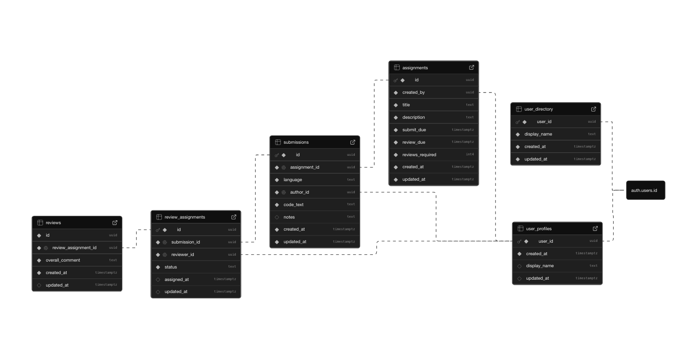
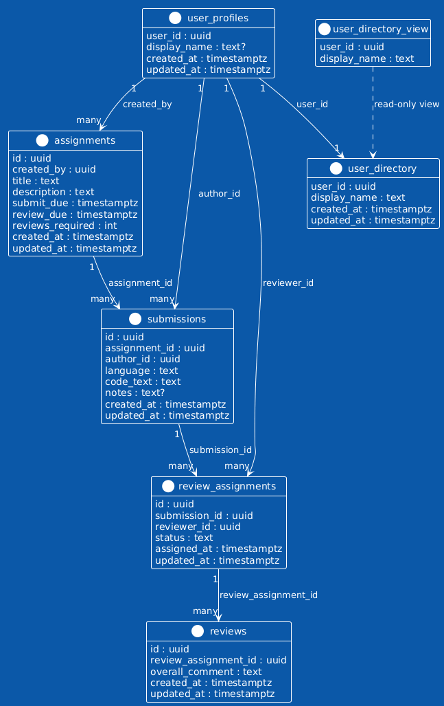

# Peer Code Review & Feedback Platform

## Project Overview

The Peer Code Review & Feedback Platform is a full-stack web application designed to facilitate structured peer code review within academic and collaborative settings. Students submit code assignments and are assigned as peer reviewers to evaluate others' work using rubric-based feedback criteria.

The platform emphasizes **security-first design**, using PostgreSQL Row Level Security (RLS) policies as the primary authorization mechanism rather than relying solely on application-level checks.

---

## Motivation & Problem Statement

Traditional code review workflows in educational settings often suffer from:

- **Unclear assignment of reviewers** - Students aren't sure who reviews their code
- **Inconsistent feedback** - Without structured rubrics, feedback quality varies
- **Data leakage risks** - One student might accidentally access another's code
- **Scalability challenges** - Manual assignment and review coordination is tedious

This platform solves these problems by:
- Automating reviewer assignment
- Enforcing access control at the database level (not just the application)
- Providing a structured review interface
- Scaling to support large classes without manual coordination

---

## Core Features

### Currently Implemented

- **User Authentication** - Supabase Auth (email/password, extensible to SSO)
- **User Profiles & Directory** - Students can view available peers for peer review assignment
- **Dashboard** - Overview of assignments, reviews, and recent activity
- **Assignment Creation UI** - Form for students to submit code with title and language selection
- **Peer Reviewer Selection UI** - Students explicitly select peer reviewers from the user directory
- **Code Review Interface** - Structured review page with code display and comment textarea
- **Row Level Security** - Database policies enforce user isolation and access control

### Planned (Not Yet Implemented)

- Persistent storage of assignments and submissions
- Persistent storage of reviews and feedback
- Rubric-based scoring system
- Comment threads within code reviews
- Gradebook and analytics dashboard
- Email notifications

---

## Architecture Overview

### Technology Stack

| Layer | Technology | Role |
|-------|-----------|------|
| **Frontend** | Next.js 15 (App Router) | Server and client components, routing, UI |
| **Database** | Supabase (PostgreSQL) | Data storage, RLS policies, real-time queries |
| **Authentication** | Supabase Auth | User registration, login, session management |
| **Testing** | Vitest, jsdom | Unit tests, integration tests, RLS validation |

### Why Supabase + RLS?

Traditional architectures often separate concerns: frontend, backend API, database. This project takes a different approach:

1. **No custom REST API layer** - The Next.js frontend connects directly to Supabase via `@supabase/supabase-js`
2. **Security enforced at database level** - PostgreSQL RLS policies prevent unauthorized queries from succeeding, regardless of client-side code
3. **Reduced backend complexity** - Less code to maintain and fewer potential security gaps
4. **Simplified deployment** - Database handles authorization logic, not a custom backend service

```
┌─────────────────────────────────────────┐
│         Next.js Frontend                 │
│  (Dashboard, Assignment, Review pages)   │
└──────────────────┬──────────────────────┘
                   │
         Supabase Client SDK
         (@supabase/supabase-js)
                   │
┌──────────────────▼──────────────────────┐
│      Supabase (PostgreSQL + Auth)       │
│  ┌───────────────────────────────────┐  │
│  │  RLS Policies (Authorization)     │  │
│  │  ├─ user_profiles                 │  │
│  │  ├─ assignments                   │  │
│  │  ├─ submissions                   │  │
│  │  ├─ review_assignments            │  │
│  │  └─ reviews                       │  │
│  └───────────────────────────────────┘  │
└─────────────────────────────────────────┘
```

---

## Security Model

### Row Level Security (RLS) Explained

PostgreSQL Row Level Security is a database feature that restricts which rows a user can see or modify based on policies written in SQL. Unlike application-level authorization (if/else checks), RLS operates at the database layer—a query will not return restricted rows, period.

#### Example: User Can Only See Their Own Profile

```sql
CREATE POLICY user_sees_own_profile ON user_profiles
  FOR SELECT
  USING (auth.uid() = user_id);
```

This policy means:
- A user querying `SELECT * FROM user_profiles WHERE user_id = X` will only get results if `X` is their own ID
- If they try to query another user's profile, the row simply won't be returned (no error, no data leak)
- This happens at the database level, before the application code runs

#### Why This Matters

1. **Defense in Depth** - Even if application code has a bug, the database won't leak data
2. **No Privilege Escalation** - A compromised user session can't bypass RLS policies
3. **Compliance** - Provides verifiable access control for regulated environments

### Policy-Based Access Control

Each table has RLS policies defining:
- **Who** can perform an action (identified by `auth.uid()`)
- **What** action (SELECT, INSERT, UPDATE, DELETE)
- **When** (the WHERE condition that restricts rows)

Current policies protect:
- Users can only read/update their own profile
- Users can only submit their own assignments
- Users can only review code assigned to them
- Admins (future) have unrestricted access

---

## Database Schema (High Level)



*The diagram above illustrates the high-level database schema and table relationships enforced by Row Level Security (RLS).*

### Core Tables

**user_profiles**

| Column | Type | Nullable | Default |
|--------|------|----------|---------|
| user_id | uuid | NO | (from auth) |
| created_at | timestamp with time zone | NO | now() AT TIME ZONE 'utc' |
| display_name | text | YES | null |
| updated_at | timestamp with time zone | YES | now() AT TIME ZONE 'utc' |

RLS: Users can only read their own profile. Users can read all profiles in the directory.

---

**assignments**

| Column | Type | Nullable | Default |
|--------|------|----------|---------|
| id | uuid | NO | gen_random_uuid() |
| created_by | uuid | NO | auth.uid() |
| title | text | NO | '' |
| description | text | NO | 'NULL' |
| submit_due | timestamp with time zone | NO | null |
| review_due | timestamp with time zone | NO | null |
| reviews_required | integer | NO | null |
| created_at | timestamp with time zone | NO | now() AT TIME ZONE 'utc' |
| updated_at | timestamp with time zone | NO | now() AT TIME ZONE 'utc' |

RLS: Students can read assignments they created. Students can also read assignments where they are assigned as reviewers.

---

**submissions**

| Column | Type | Nullable | Default |
|--------|------|----------|---------|
| id | uuid | NO | gen_random_uuid() |
| assignment_id | uuid | NO | null |
| language | text | NO | null |
| author_id | uuid | NO | auth.uid() |
| code_text | text | NO | null |
| notes | text | YES | null |
| created_at | timestamp with time zone | NO | now() AT TIME ZONE 'utc' |
| updated_at | timestamp with time zone | NO | now() AT TIME ZONE 'utc' |

RLS: Users can only read their own submissions. Users can only update their own submissions.

---

**review_assignments**

| Column | Type | Nullable | Default |
|--------|------|----------|---------|
| id | uuid | NO | gen_random_uuid() |
| submission_id | uuid | NO | null |
| reviewer_id | uuid | NO | null |
| status | text | NO | 'assigned' |
| assigned_at | timestamp with time zone | YES | now() |
| updated_at | timestamp with time zone | YES | now() |

RLS: Users can only see review assignments where they are the reviewer.

---

**reviews**

| Column | Type | Nullable | Default |
|--------|------|----------|---------|
| id | uuid | NO | gen_random_uuid() |
| review_assignment_id | uuid | NO | null |
| overall_comment | text | NO | null |
| created_at | timestamp with time zone | NO | now() |
| updated_at | timestamp with time zone | YES | now() |

RLS: Users can only create and update their own reviews.

---

**user_directory** (Table)

| Column | Type | Nullable | Default |
|--------|------|----------|---------|
| user_id | uuid | NO | null |
| display_name | text | NO | null |
| created_at | timestamp with time zone | NO | now() |
| updated_at | timestamp with time zone | NO | now() |

RLS: All authenticated users can read (read-only directory of active users).

---

**user_directory_view** (Read-Only View)

| Column | Type | Nullable |
|--------|------|----------|
| user_id | uuid | YES |
| display_name | text | YES |

A curated view of the user directory for public display in reviewer selection.

---

### Relationships

```
user_profiles
    ├── 1:many → assignments (created_by)
    ├── 1:many → submissions (author_id)
    ├── 1:many → review_assignments (reviewer_id)
    └── 1:many → user_directory (user_id)

assignments
    └── 1:many → submissions (assignment_id)

submissions
    ├── many:1 ← assignments (assignment_id)
    └── 1:many → review_assignments (submission_id)

review_assignments
    ├── many:1 ← submissions (submission_id)
    ├── many:1 ← user_profiles (reviewer_id)
    └── 1:many → reviews (review_assignment_id)

reviews
    └── many:1 ← review_assignments (review_assignment_id)
```

---

## Database Schema UML



*This UML diagram provides a structural view of the database entities, attributes, and cardinality relationships used in the peer review workflow.*

---

## Testing Strategy

### Why Database Tests Matter

Application unit tests (e.g., testing a button click) don't verify that security policies actually work. Database tests do.

### Test Approach

- **No mocking** - Tests run against a real Supabase instance (staging or dedicated test project)
- **RLS validation** - Each test confirms that a policy allows or denies access as intended
- **User isolation** - Tests create temporary users and verify they can't see each other's data
- **Node environment** - Tests run in Vitest with Node.js (no browser needed)

### Running Database Tests

```bash
vitest tests/db/ --environment node
```

See [DB_TESTING.md](DB_TESTING.md) for detailed testing documentation.

### Test Coverage

**Currently Tested:**
- `user_profiles` RLS policies
  - User can read their own profile ✓
  - User cannot read another user's profile ✓

**Planned:**
- `assignments` RLS (user can only submit their own)
- `review_assignments` RLS (reviewer can only see assigned reviews)
- `reviews` RLS (user can only create their own reviews)

---

## Local Development Setup

### Prerequisites

- Node.js 18+
- npm or yarn
- A Supabase project (free tier works)

### Environment Variables

Create a `.env.local` file in the project root:

```bash
# Supabase (public keys, safe to expose in frontend)
NEXT_PUBLIC_SUPABASE_URL=https://your-project.supabase.co
NEXT_PUBLIC_SUPABASE_ANON_KEY=your_anon_key_here

# For database testing only (not used in production)
# Create a .env.test file for these
SUPABASE_URL=https://your-project.supabase.co
SUPABASE_SERVICE_ROLE_KEY=your_service_role_key_here
TEST_PASSWORD=SecureTestPass123!
TEST_EMAIL_DOMAIN=example.test
```

**⚠️ Security Note:** The `NEXT_PUBLIC_*` variables are visible to the browser (that's intentional—Supabase uses them for client-side auth). The service role key should **never** be exposed to the browser or checked into git.

### Installation & Running

```bash
# Install dependencies
npm install

# Start development server
npm run dev

# Visit http://localhost:3000
```

### Building for Production

```bash
npm run build
npm start
```

### Running Tests

```bash
# Run all tests
npm test

# Run tests in watch mode
npm test -- --watch

# Run only database integration tests
vitest tests/db/ --environment node

# Generate coverage report
npm run test:coverage
```

---

## Current Status

### What's Working ✓

- **Authentication Flow** - Sign up, login, logout via Supabase Auth
- **Dashboard** - User-authenticated dashboard with welcome message
- **User Directory** - Available peers fetched from Supabase in real-time
- **Assignment UI** - Form to submit code with title, language, and code
- **Reviewer Selection UI** - UI to toggle reviewers and preview selection
- **Review List UI** - List of assigned reviews with status
- **Code Review UI** - Interface to view submitted code and write feedback
- **Database Tests** - RLS validation tests for user_profiles table
- **Documentation** - DB_TESTING.md explains testing strategy

### What's In Progress 🔄

- Connecting assignment submission UI to Supabase (create assignments table)
- Implementing review assignment workflow
- Connecting review submission to database

### What's Not Yet Started ❌

- Scoring/rubric system
- Review comments/threads
- Notifications
- Admin dashboard
- Gradebook and analytics

---

## Future Work

### Short Term (Next 1-2 sprints)

1. **Complete CRUD for assignments** - Save/retrieve from database with RLS
2. **Review assignment backend** - Implement assignment creation and RLS policies
3. **Review submission backend** - Store reviews in database
4. **Improve error handling** - Better user feedback for failed operations
5. **Add more database tests** - Cover assignments, reviews, and review_assignments tables

### Medium Term

- Rubric-based feedback (structured scoring criteria)
- Comment threads within code (multi-level comments on specific lines)
- Email notifications (on assignment, review completion, feedback received)
- Real-time updates (use Supabase Realtime to push updates to connected clients)

### Long Term

- Mobile-friendly responsive design refinement
- AI-assisted feedback suggestions
- Integration with version control (GitHub, GitLab)
- Support for diff-based code review
- Instructors' analytics dashboard

---

## Team Collaboration Notes

### Code Standards

- **No semicolons** - This codebase uses ASI (Automatic Semicolon Insertion); be consistent
- **TypeScript** - Use types for all data structures and function parameters
- **React Hooks** - Use functional components with hooks, not class components
- **CSS Classes** - Follow existing naming (e.g., `dashboard-section`, `btn btn-primary`)

### Git Workflow

1. Create a feature branch: `git checkout -b feature/short-description`
2. Make atomic commits with clear messages
3. Push to your fork and open a pull request
4. Link related issues in PR description
5. Request review from teammates

### Testing Before Push

```bash
# Run tests
npm test

# Check for errors
npm run lint

# Build to catch any issues
npm run build
```

### Important Files to Know

- `app/dashboard/page.tsx` - Main user dashboard
- `app/assignments/new/page.tsx` - Start assignment form
- `app/reviews/page.tsx` - List of assigned reviews
- `app/reviews/[id]/page.tsx` - Individual review interface
- `lib/supabaseClient.ts` - Supabase client initialization
- `tests/db/` - Database integration tests
- `styles/globals.css` - Shared styles
- `DB_TESTING.md` - Guide to running and writing RLS tests

### Getting Help

- Check existing issues before opening a new one
- Ask questions in team chat before starting big changes
- Document non-obvious decisions in commit messages or comments
- Keep README and documentation in sync with code

---

## License

This project is part of a university course and is not licensed for external use.

---

## Acknowledgments

Built by a Team Green of UNT in CSCE 5430!!! Students learning full-stack web development, database security, and collaborative software engineering practices!!✨🚀😁✨
