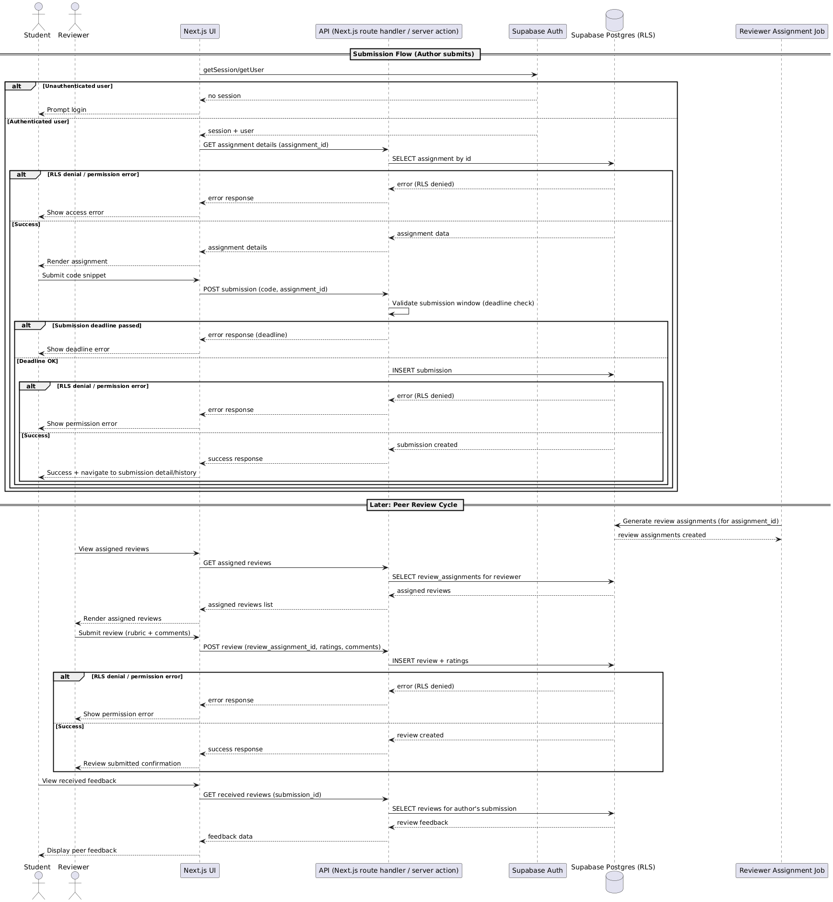
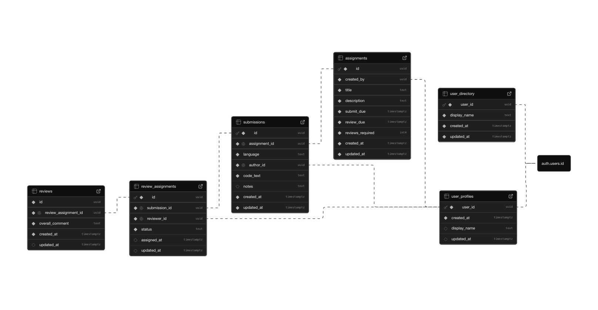
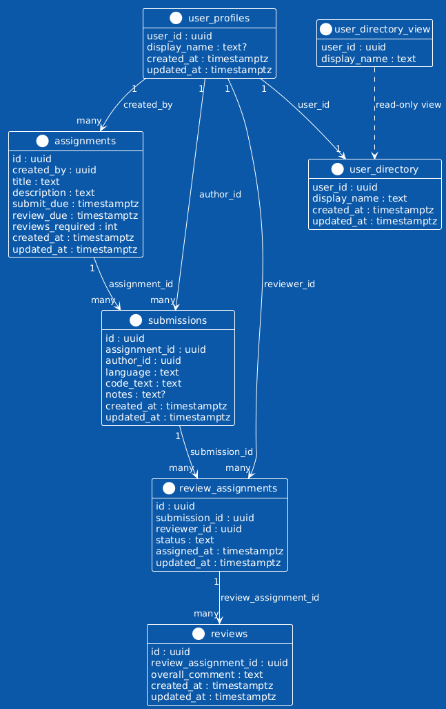

# Peer Code Review & Feedback Platform

## Project Overview

The Peer Code Review & Feedback Platform is a full-stack web application designed to facilitate structured peer code review within academic and collaborative settings. Students submit code assignments and are assigned as peer reviewers to evaluate others' work using rubric-based feedback criteria.

The platform emphasizes **security-first design**, using PostgreSQL Row Level Security (RLS) policies as the primary authorization mechanism rather than relying solely on application-level checks.

---

## Current Implementation Status (MVP Progress)

This is an MVP with a complete and operational core workflow. It currently uses a simplified student-only model:

- There is only one role: Student.
- Students create assignments.
- Students submit code under assignments.
- Students manually assign reviewer(s) to submissions.
- Assigned reviewers complete reviews.
- Submitters can view feedback received.

The application is wired end-to-end to the database for the full peer-review lifecycle:

1. A student creates an assignment.
2. Students submit code under that assignment.
3. A student assigns one or more reviewers to a submission.
4. Reviewer assignments are persisted in the database.
5. Reviewers can view submissions assigned to them.
6. Reviewers can submit overall comments.
7. Submitters can view the reviews they have received.

Technical implementation status:

- Supabase (PostgreSQL) is fully integrated.
- Core tables (Assignments, Submissions, ReviewAssignments, Reviews) are connected.
- Row Level Security (RLS) is enabled.
- RLS policies enforce:
    - Students can only see their own submissions.
    - Reviewers can only see submissions explicitly assigned to them.
    - Students can only view reviews tied to their own submissions.
- All core lifecycle actions persist correctly in the database.

### What Is Currently Working

- Assignment creation (student-driven)
- Code submission
- Manual reviewer assignment
- Review submission
- Viewing received feedback
- Viewing assigned reviews
- Database persistence with RLS enforcement
- Additional automated test coverage
- UI polish and edge-case validation
- Performance optimization

The core peer-review lifecycle is now functionally operational and database-backed.

---

## Motivation & Problem Statement

Traditional code review workflows in educational settings often suffer from:

- **Unclear assignment of reviewers** - Students aren't sure who reviews their code
- **Inconsistent feedback** - Without structured rubrics, feedback quality varies
- **Data leakage risks** - One student might accidentally access another's code
- **Scalability challenges** - Manual assignment and review coordination is tedious

This platform solves these problems by:
- Automating reviewer assignment
- Enforcing access control at the database level (not just the application)
- Providing a structured review interface
- Scaling to support large classes without manual coordination

---

## Core Features

### Currently Implemented

- **User Authentication** - Supabase Auth (email/password, extensible to SSO)
- **User Profiles & Directory** - Students can view available peers for peer review assignment
- **Dashboard** - Overview of assignments, reviews, and recent activity
- **Assignment Creation UI** - Form for students to submit code with title and language selection
- **Peer Reviewer Selection UI** - Students explicitly select peer reviewers from the user directory
- **Code Review Interface** - Structured review page with code display and comment textarea
- **Row Level Security** - Database policies enforce user isolation and access control
- Persistent storage of assignments and submissions
- Persistent storage of reviews and feedback
- Rubric-based scoring system
- Comment threads within code reviews

---

## Architecture Overview

### Technology Stack

| Layer | Technology | Role |
|-------|-----------|------|
| **Frontend** | [Next.js 15 (App Router)](https://nextjs.org/docs) | Server and client components, routing, UI |
| **Styling** | Custom CSS | Semantic class-based styling (see [STYLING.md](STYLING.md)) |
| **Database** | [Supabase](https://supabase.com/docs) (Auth, RLS, Realtime) | Data storage, RLS policies, real-time queries |
| **Authentication** | Supabase Auth | User registration, login, session management |
| **Testing** | [Vitest](https://vitest.dev/), jsdom | Unit tests, integration tests, RLS validation |

### Why Supabase + RLS?

Traditional architectures often separate concerns: frontend, backend API, database. This project takes a different approach:

1. **No custom REST API layer** - The Next.js frontend connects directly to Supabase via `@supabase/supabase-js`
2. **Security enforced at database level** - PostgreSQL RLS policies prevent unauthorized queries from succeeding, regardless of client-side code
3. **Reduced backend complexity** - Less code to maintain and fewer potential security gaps
4. **Simplified deployment** - Database handles authorization logic, not a custom backend service

```
┌─────────────────────────────────────────┐
│         Next.js Frontend                 │
│  (Dashboard, Assignment, Review pages)   │
└──────────────────┬──────────────────────┘
                   │
         Supabase Client SDK
         (@supabase/supabase-js)
                   │
┌──────────────────▼──────────────────────┐
│      Supabase (PostgreSQL + Auth)       │
│  ┌───────────────────────────────────┐  │
│  │  RLS Policies (Authorization)     │  │
│  │  ├─ user_profiles                 │  │
│  │  ├─ assignments                   │  │
│  │  ├─ submissions                   │  │
│  │  ├─ review_assignments            │  │
│  │  └─ reviews                       │  │
│  └───────────────────────────────────┘  │
└─────────────────────────────────────────┘
```

---

## Main Application Flow – Submission & Peer Review



### 1. Authentication & Session Validation
The Next.js UI begins by validating the session through Supabase Auth using session/user lookups. This step determines whether the Student (Author) is authenticated before any protected data access occurs. Unauthenticated requests short-circuit at the UI layer, while authenticated requests proceed to downstream API and database operations.

### 2. Assignment Access & Authorization
The UI requests assignment details through the API, which queries Supabase Postgres. Row Level Security (RLS) enforces access rules at the database layer; unauthorized reads are denied by the database and the resulting permission error is propagated back through the API to the UI for user-facing handling.

### 3. Submission Creation Flow
The Student (Author) submits a code snippet through the UI, which sends a submission request to the API. The API evaluates submission deadline constraints and then attempts to insert the submission in Supabase Postgres. RLS policies guard the insert; permission failures return an error, while successful inserts return a confirmation. On success, the UI transitions to the submission detail/history view.

### 4. Peer Review Assignment (Asynchronous)
Reviewer assignment happens later through a background Reviewer Assignment Job. This process is decoupled from the interactive submission request and creates review assignments after the initial submission flow completes.

### 5. Review Completion Flow
The Reviewer retrieves assigned reviews through the UI, which calls the API to fetch review assignments from Supabase Postgres. The Reviewer submits rubric ratings and comments via the UI, and the API persists the review to the database. RLS enforcement applies during review insertion to ensure only assigned reviewers can submit.

### 6. Feedback Retrieval
The original author later fetches received feedback through the UI. The API queries Supabase Postgres for reviews tied to the author’s submissions, and RLS ensures that only feedback for the author’s own submissions is returned.

---

## Security Model

### Row Level Security (RLS) Explained

PostgreSQL Row Level Security is a database feature that restricts which rows a user can see or modify based on policies written in SQL. Unlike application-level authorization (if/else checks), RLS operates at the database layer—a query will not return restricted rows, period.

#### Example: User Can Only See Their Own Profile

```sql
CREATE POLICY user_sees_own_profile ON user_profiles
  FOR SELECT
  USING (auth.uid() = user_id);
```

This policy means:
- A user querying `SELECT * FROM user_profiles WHERE user_id = X` will only get results if `X` is their own ID
- If they try to query another user's profile, the row simply won't be returned (no error, no data leak)
- This happens at the database level, before the application code runs

#### Why This Matters

1. **Defense in Depth** - Even if application code has a bug, the database won't leak data
2. **No Privilege Escalation** - A compromised user session can't bypass RLS policies
3. **Compliance** - Provides verifiable access control for regulated environments

### Policy-Based Access Control

Each table has RLS policies defining:
- **Who** can perform an action (identified by `auth.uid()`)
- **What** action (SELECT, INSERT, UPDATE, DELETE)
- **When** (the WHERE condition that restricts rows)

Current policies protect:
- Users can only read/update their own profile
- Users can only submit their own assignments
- Users can only review code assigned to them
- Admins (future) have unrestricted access

---

## Database Schema (High Level)



*The diagram above illustrates the high-level database schema and table relationships enforced by Row Level Security (RLS).*

### Core Tables

**user_profiles**

| Column | Type | Nullable | Default |
|--------|------|----------|---------|
| user_id | uuid | NO | (from auth) |
| created_at | timestamp with time zone | NO | now() AT TIME ZONE 'utc' |
| display_name | text | YES | null |
| updated_at | timestamp with time zone | YES | now() AT TIME ZONE 'utc' |

RLS: Users can only read their own profile. Users can read all profiles in the directory.

---

**assignments**

| Column | Type | Nullable | Default |
|--------|------|----------|---------|
| id | uuid | NO | gen_random_uuid() |
| created_by | uuid | NO | auth.uid() |
| title | text | NO | '' |
| description | text | NO | 'NULL' |
| submit_due | timestamp with time zone | NO | null |
| review_due | timestamp with time zone | NO | null |
| reviews_required | integer | NO | null |
| created_at | timestamp with time zone | NO | now() AT TIME ZONE 'utc' |
| updated_at | timestamp with time zone | NO | now() AT TIME ZONE 'utc' |

RLS: Students can read assignments they created. Students can also read assignments where they are assigned as reviewers.

---

**submissions**

| Column | Type | Nullable | Default |
|--------|------|----------|---------|
| id | uuid | NO | gen_random_uuid() |
| assignment_id | uuid | NO | null |
| language | text | NO | null |
| author_id | uuid | NO | auth.uid() |
| code_text | text | NO | null |
| notes | text | YES | null |
| created_at | timestamp with time zone | NO | now() AT TIME ZONE 'utc' |
| updated_at | timestamp with time zone | NO | now() AT TIME ZONE 'utc' |

RLS: Users can only read their own submissions. Users can only update their own submissions.

---

**review_assignments**

| Column | Type | Nullable | Default |
|--------|------|----------|---------|
| id | uuid | NO | gen_random_uuid() |
| submission_id | uuid | NO | null |
| reviewer_id | uuid | NO | null |
| status | text | NO | 'assigned' |
| assigned_at | timestamp with time zone | YES | now() |
| updated_at | timestamp with time zone | YES | now() |

RLS: Users can only see review assignments where they are the reviewer.

---

**reviews**

| Column | Type | Nullable | Default |
|--------|------|----------|---------|
| id | uuid | NO | gen_random_uuid() |
| review_assignment_id | uuid | NO | null |
| overall_comment | text | NO | null |
| created_at | timestamp with time zone | NO | now() |
| updated_at | timestamp with time zone | YES | now() |

RLS: Users can only create and update their own reviews.

---

**user_directory** (Table)

| Column | Type | Nullable | Default |
|--------|------|----------|---------|
| user_id | uuid | NO | null |
| display_name | text | NO | null |
| created_at | timestamp with time zone | NO | now() |
| updated_at | timestamp with time zone | NO | now() |

RLS: All authenticated users can read (read-only directory of active users).

---

**user_directory_view** (Read-Only View)

| Column | Type | Nullable |
|--------|------|----------|
| user_id | uuid | YES |
| display_name | text | YES |

A curated view of the user directory for public display in reviewer selection.

---

### Relationships

```
user_profiles
    ├── 1:many → assignments (created_by)
    ├── 1:many → submissions (author_id)
    ├── 1:many → review_assignments (reviewer_id)
    └── 1:many → user_directory (user_id)

assignments
    └── 1:many → submissions (assignment_id)

submissions
    ├── many:1 ← assignments (assignment_id)
    └── 1:many → review_assignments (submission_id)

review_assignments
    ├── many:1 ← submissions (submission_id)
    ├── many:1 ← user_profiles (reviewer_id)
    └── 1:many → reviews (review_assignment_id)

reviews
    └── many:1 ← review_assignments (review_assignment_id)
```

---

## Database Schema UML



*This UML diagram provides a structural view of the database entities, attributes, and cardinality relationships used in the peer review workflow.*

---

## Testing Strategy

### Why Database Tests Matter

Application unit tests (e.g., testing a button click) don't verify that security policies actually work. Database tests do.

### Test Approach

- **No mocking** - Tests run against a real Supabase instance (staging or dedicated test project)
- **RLS validation** - Each test confirms that a policy allows or denies access as intended
- **User isolation** - Tests create temporary users and verify they can't see each other's data
- **Node environment** - Tests run in Vitest with Node.js (no browser needed)

### Running Database Tests

```bash
vitest tests/db/ --environment node
```

See [DB_TESTING.md](DB_TESTING.md) for detailed testing documentation.

### Test Coverage

**Currently Tested:**
- `user_profiles` RLS policies
  - User can read their own profile ✓
  - User cannot read another user's profile ✓

**Planned:**
- `assignments` RLS (user can only submit their own)
- `review_assignments` RLS (reviewer can only see assigned reviews)
- `reviews` RLS (user can only create their own reviews)

---

## Code Coverage

Vitest coverage is enabled for the main application workflows, with the strongest focus on CORE user flows such as authentication, dashboard behavior, submission handling, reviewer assignment, and review completion.

| Metric | Result |
|-------|--------|
| Statements | 82.66% |
| Branches | 73.93% |
| Functions | 89.61% |
| Lines | 82.66% |

### What Is Covered

- Authentication flows and session handling
- Dashboard loading, success, and error states
- Submission and review workflow validation
- Reviewer assignment business logic
- Review visibility and access-control behavior

### Running Coverage

```bash
npm run coverage
```

### HTML Coverage Report

After the coverage run completes, open the generated HTML report at:

```text
coverage/index.html
```

### Notes

- Coverage reporting is generated into the `./coverage` directory
- Database-only tests under `tests/db/**` are excluded from coverage because they depend on live Supabase connectivity
- Framework wrapper files such as `layout.tsx` are not a testing priority compared with core workflow logic

---

## Local Development Setup

### Prerequisites

- Node.js 18+
- npm or yarn
- A Supabase project (free tier works)

### Environment Variables

Create a `.env.local` file in the project root:

```bash
# Supabase (public keys, safe to expose in frontend)
NEXT_PUBLIC_SUPABASE_URL=https://your-project.supabase.co
NEXT_PUBLIC_SUPABASE_ANON_KEY=your_anon_key_here

# For database testing only (not used in production)
# Create a .env.test file for these
SUPABASE_URL=https://your-project.supabase.co
SUPABASE_SERVICE_ROLE_KEY=your_service_role_key_here
TEST_PASSWORD=SecureTestPass123!
TEST_EMAIL_DOMAIN=example.test
```

**⚠️ Security Note:** The `NEXT_PUBLIC_*` variables are visible to the browser (that's intentional—Supabase uses them for client-side auth). The service role key should **never** be exposed to the browser or checked into git.

### Installation & Running

```bash
# Install dependencies
npm install

# Start development server
npm run dev

# Visit http://localhost:3000
```

### Building for Production

```bash
npm run build
npm start
```

### Running Tests

```bash
# Run all tests
npm test

# Run tests in watch mode
npm test -- --watch

# Run only database integration tests
vitest tests/db/ --environment node

# Generate coverage report
npm run coverage
```

---

## Future Work

### Medium Term

- Rubric-based feedback (structured scoring criteria)
- Email notifications (on assignment, review completion, feedback received)
- Real-time updates (use Supabase Realtime to push updates to connected clients)

---

## Team Collaboration Notes

### Code Standards

- **No semicolons** - This codebase uses ASI (Automatic Semicolon Insertion); be consistent
- **TypeScript** - Use types for all data structures and function parameters
- **React Hooks** - Use functional components with hooks, not class components
- **CSS Classes** - Follow existing naming (e.g., `dashboard-section`, `btn btn-primary`). See [STYLING.md](STYLING.md) for the complete styling guide

### Git Workflow

1. Create a feature branch: `git checkout -b feature/short-description`
2. Make atomic commits with clear messages
3. Push to your fork and open a pull request
4. Link related issues in PR description
5. Request review from teammates

### Testing Before Push

```bash
# Run tests
npm test

# Check for errors
npm run lint

# Build to catch any issues
npm run build
```

### Important Files to Know

- `app/dashboard/page.tsx` - Main user dashboard
- `app/assignments/new/page.tsx` - Start assignment form
- `app/reviews/page.tsx` - List of assigned reviews
- `app/reviews/[id]/page.tsx` - Individual review interface
- `lib/supabaseClient.ts` - Supabase client initialization
- `tests/db/` - Database integration tests
- `styles/globals.css` - Shared styles
- `STYLING.md` - Complete styling guide and best practices
- `DB_TESTING.md` - Guide to running and writing RLS tests

### Getting Help

- Check existing issues before opening a new one
- Ask questions in team chat before starting big changes
- Document non-obvious decisions in commit messages or comments
- Keep README and documentation in sync with code

---

## License

This project is part of a university course and is not licensed for external use.

---

## Acknowledgments

Built by a Team Green of UNT in CSCE 5430!!! Students learning full-stack web development, database security, and collaborative software engineering practices!!✨🚀😁✨
